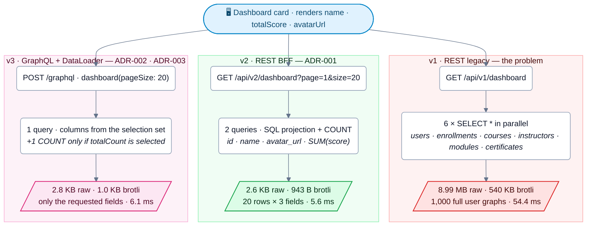
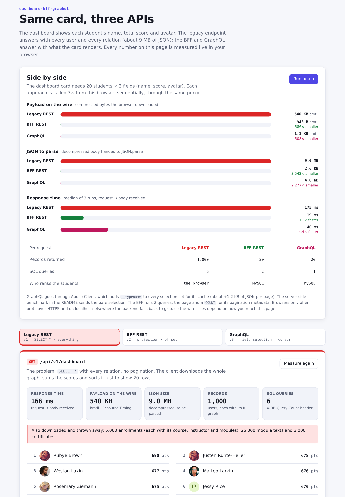
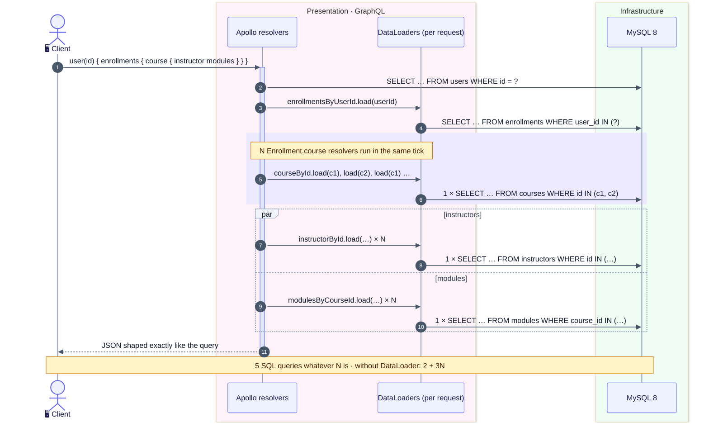

# 📊 dashboard-bff-graphql

> Reducing a 9 MB API response to 2.6 KB — solving over-fetching and the N+1 problem with a
> Backend-for-Frontend (BFF) and GraphQL.

[](https://www.typescriptlang.org/)
[](https://www.apollographql.com/docs/apollo-server/)
[](https://nodejs.org/)
[](docs/adr/)
[](https://docs.docker.com/compose/)
[](#-quality-gates--test-coverage)
[](#-quality-gates--test-coverage)
[](./LICENSE)

---

## 🎯 The Problem

In enterprise LMS and EdTech platforms, dashboard interfaces often suffer from severe API
over-fetching. A generic REST endpoint returns entire domain entity graphs (users, enrollments,
courses, modules, instructors, certificates), while the frontend UI only needs **3 visual fields**
(`name`, `totalScore`, `avatarUrl`) to render the student leaderboard.

```
GET /api/v1/dashboard

Response: 8.99 MB (9,428,641 bytes)
├── 1,000 users × full profile (email, bio, avatar, created_at)
├── 5,000 enrollments × every relational attribute
├── 200 courses × description + category + duration + instructor
├── 1,000 modules × full text content + orderIndex
└── 3,000 certificates × verification numbers + PDF URLs

Frontend UI needs: name, totalScore, avatarUrl  (3 fields)
```

## 💡 The Solution — three ways to fill the same card



---

## ⚡ Empirical Benchmark Results (Reproducible)

`npm run benchmark` against MySQL 8 with the deterministic SPEC dataset (**1,000 users,
50 instructors, 200 courses, 1,000 modules, 5,000 enrollments, 3,000 certificates**), median of
5 sequential runs per endpoint:

| Approach | Endpoint | Records | Raw Payload | Gzip | Brotli | SQL Queries | Median Latency | Payload Reduction |
|---|---|:---:|:---:|:---:|:---:|:---:|:---:|:---:|
| **v1: REST Legacy** | `GET /api/v1/dashboard` | 1,000 | **8.99 MB** | 2.57 MB | 540.0 KB | 6 | 54.4 ms | *Baseline* |
| **v2: REST BFF** | `GET /api/v2/dashboard` | 20 | **2.6 KB** | 974 B | 943 B | 2 | **5.6 ms** | **3,541.9x** (-99.97%) |
| **v3: GraphQL + DataLoader** | `POST /graphql` | 20 | **2.8 KB** | 1.0 KB | 1.0 KB | **1** | **6.1 ms** | **3,249.0x** (-99.97%) |

> 📁 Raw results: [`benchmarks/benchmark-results.md`](benchmarks/benchmark-results.md) and
> [`benchmarks/benchmark-results.json`](benchmarks/benchmark-results.json). Sizes use binary units
> (1 MB = 1,048,576 bytes).

### 🔍 Key Architectural Insights

1. **Over-fetching eradicated** — both the BFF and GraphQL cut the transferred payload by more than
   **3,200×** (from ~9 MB to ~2.6 KB): less bandwidth, less JSON to serialize and parse.
2. **Less database work** — v2 runs a SQL projection plus a `COUNT` for pagination (2 queries).
   v3 runs **1 query**: the selection set decides which columns are read, and `totalCount` (an
   extra `COUNT`) is only executed when the client asks for it. Nested relations are batched by
   DataLoader (see below), so the query count does not grow with the number of rows.
3. **~10× lower latency** — the median server-side latency dropped from **54.4 ms to 5.6 ms** on a
   local MySQL; on real mobile networks the 3,500× smaller payload matters even more.

---

## 🖥️ Visual Comparison — React Frontend

<picture>
  <source media="(prefers-color-scheme: dark)" srcset="docs/images/frontend-dark.png">
  
</picture>

`frontend/` is a Vite + React 19 + Apollo Client 4 SPA that measures the three approaches **from
the browser**, not from the server:

- **Side by side** — page 1 of each approach, called 3× sequentially (median time). Bytes on the
  wire come from the Resource Timing API (`encodedBodySize`) together with the `Content-Encoding`
  the backend chose; the SQL query count comes from the `X-DB-Query-Count` header.
- **Three tabs** (Legacy REST · BFF REST · GraphQL) — each shows response time, payload size,
  number of records and the 3 fields the card actually renders (name, score, avatar). The legacy
  tab ranks 1,000 users in the browser; the BFF tab pages with `page`/`size` (offset); the GraphQL
  tab uses Apollo's `relayStylePagination` and sends `after: endCursor` on "Load more".
- **Same origin** — nginx (Docker) or the Vite dev server proxies `/api`, `/graphql` and `/health`
  to the backend, so the browser can read those headers and sizes without CORS.

Measured in Chromium on `localhost` (brotli):

| | Records | JSON to parse | On the wire | SQL queries |
|---|---:|---:|---:|---:|
| **Legacy REST** | 1,000 | 9.0 MB | 540 KB | 6 |
| **BFF REST** | 20 | 2.6 KB | 943 B | 2 |
| **GraphQL (Apollo Client)** | 20 | 4.0 KB | 1.1 KB | 1 |

> GraphQL is 4.0 KB here versus 2.8 KB in the server-side benchmark because Apollo Client adds
> `__typename` to every selection set for its normalized cache. Browsers only offer brotli over
> HTTPS and on `localhost`; reached through another host name, the backend falls back to gzip
> (2.6 MB for the legacy payload). The orderings match: BFF page 2 equals ranks 21–40 of the
> legacy list ranked in the browser, and GraphQL "Load more" returns the same top 40 as the BFF.

---

## 🧬 N+1 Prevention with DataLoader

A nested query such as `user(id) { enrollments { course { instructor modules } } }` would naively
issue `2 + 3N` SQL queries (N = enrollments). Request-scoped DataLoaders collect every `load()`
issued in the same tick and turn them into **one `WHERE … IN (…)` query per relation level**:



Proven by [`tests/integration/dataloader-lifecycle-and-security.test.ts`](tests/integration/dataloader-lifecycle-and-security.test.ts):
3 enrollments pointing to 2 courses trigger exactly **1** courses query, and loaders are created
per request, so the cache never leaks data between users ([ADR-003](docs/adr/003-dataloader-n-plus-one.md)).

---

## 🏗️ Architecture: Clean Architecture + DDD

Dependencies point inward: presentation and infrastructure depend on the application core, the
domain depends on nothing.

```mermaid
%%{init: {"theme": "base", "themeVariables": {"fontFamily": "Inter, Segoe UI, Helvetica, Arial, sans-serif", "fontSize": "15px", "lineColor": "#64748B", "primaryTextColor": "#0F172A", "clusterBkg": "#F8FAFC", "clusterBorder": "#CBD5E1", "titleColor": "#0F172A", "edgeLabelBackground": "#FFFFFF"}, "flowchart": {"curve": "basis", "nodeSpacing": 30, "rankSpacing": 60, "padding": 14, "wrappingWidth": 260}}}%%
flowchart LR
    subgraph IN["🚪 Presentation · driving adapters"]
        direction TB
        REST("REST · Express 5<br/><i>v1 · v2 · /compare · /health</i>")
        GQL("GraphQL · Apollo Server 5<br/><i>schema · resolvers · depth limit</i>")
    end

    subgraph APP["⚙️ Application · use cases"]
        direction TB
        UC1("GetDashboardLegacy · v1")
        UC2("GetDashboardBFF · v2")
        UC3("GetDashboardGraphQL · GetUserProfile")
        UC4("CompareResponseSizes · CheckHealth")
    end

    subgraph CORE["💎 Domain · zero dependencies"]
        direction TB
        D1["User · Enrollment · Course"]
        D2["Instructor · Module · Certificate"]
        D3["UserName · Email · AvatarUrl · Score · Progress · CourseName"]
    end

    subgraph PORTS["🔌 Ports · interfaces owned by the core"]
        direction TB
        P1["UserRepository · DashboardRepository · LearningGraphReader"]
        P2["BatchLoaderFactory"]
        P3["PayloadCompressor · QueryCounter"]
    end

    subgraph OUT["🔧 Infrastructure · driven adapters"]
        direction TB
        A1("MySQL repositories + graph reader<br/><i>knex · SQL projections · WHERE … IN (…)</i>")
        A2("DataLoader factory<br/><i>request-scoped batching + cache</i>")
        A3("zlib gzip / brotli · knex query counter")
    end

    REST --> UC1
    REST --> UC2
    REST --> UC4
    GQL --> UC3
    APP ==>|uses| CORE
    APP -->|depends on| PORTS
    P1 -.-|implemented by| A1
    P2 -.- A2
    P3 -.- A3

    classDef pres fill:#E0F2FE,stroke:#0284C7,stroke-width:1.5px,color:#0C4A6E
    classDef app fill:#DCFCE7,stroke:#16A34A,stroke-width:1.5px,color:#052E16
    classDef dom fill:#EDE9FE,stroke:#7C3AED,stroke-width:1.5px,color:#2E1065
    classDef port fill:#FFFFFF,stroke:#7C3AED,stroke-width:1.5px,stroke-dasharray:4 3,color:#2E1065
    classDef infra fill:#FEF3C7,stroke:#D97706,stroke-width:1.5px,color:#451A03

    class REST,GQL pres
    class UC1,UC2,UC3,UC4 app
    class D1,D2,D3 dom
    class P1,P2,P3 port
    class A1,A2,A3 infra

    style IN fill:#F0F9FF,stroke:#7DD3FC,color:#0C4A6E
    style APP fill:#F0FDF4,stroke:#86EFAC,color:#052E16
    style CORE fill:#F5F3FF,stroke:#C4B5FD,color:#2E1065
    style PORTS fill:#FAF5FF,stroke:#D8B4FE,color:#2E1065
    style OUT fill:#FFFBEB,stroke:#FCD34D,color:#451A03
```



```
src/
├── domain/                    # Pure Domain Layer (zero external dependencies)
│   ├── entities/              # User, Course, Enrollment, Instructor, Module, Certificate
│   ├── value-objects/         # Email, Score, Progress, UserName, AvatarUrl, CourseName
│   ├── repositories/          # Repository interfaces (ports)
│   └── shared/                # Result pattern (Result<T, E>), type guards
│
├── application/               # Use cases & business workflows
│   ├── use-cases/             # GetDashboardLegacy, GetDashboardBFF, GetDashboardGraphQL, GetUserProfile, CompareResponseSizes, CheckHealth
│   ├── services/              # FieldSelection, LearningGraphLoaders, PaginationPolicy
│   ├── dtos/                  # Strongly-typed input/output DTOs
│   └── interfaces/            # Ports (BatchLoaderFactory, LearningGraphReader, QueryCounter, PayloadCompressor…)
│
├── infrastructure/            # Driven adapters
│   ├── database/              # Knex/MySQL repositories, learning-graph reader, migrations, query counter
│   ├── batching/              # DataLoaderBatchLoaderFactory (request-scoped batching & cache)
│   ├── compression/           # zlib gzip & brotli compressor
│   ├── lifecycle/             # Graceful shutdown
│   ├── logging/               # Structured pino logger
│   ├── system/                # Clock, performance monitor
│   └── config/                # zod environment validation & composition root
│
└── presentation/              # Driving adapters
    ├── http/                  # Express 5 controllers, routes, middlewares (query metrics, errors)
    ├── graphql/               # Apollo Server 5 schema, resolvers, context, depth-limit rule
    └── compare/               # Payload comparison sources

frontend/                      # Vite + React 19 + Apollo Client 4 comparison SPA
├── src/lib/                   # measuredFetch (Resource Timing), endpoints, Apollo client, comparison runner
├── src/hooks/                 # One hook per approach (legacy, BFF offset, GraphQL cursor)
├── src/components/            # Side-by-side bars, tabs, metric cards, leaderboard, avatar
└── nginx/                     # Production server: SPA + same-origin proxy to the backend
```

### Architectural Decisions (ADRs)

| ADR | Decision | Context & Rationale |
|---|---|---|
| [ADR-001](docs/adr/001-bff-over-generic-api.md) | **BFF over Generic API** | Decouples frontend UX needs from internal database structures. |
| [ADR-002](docs/adr/002-graphql-for-flexible-queries.md) | **GraphQL for Dynamic Field Selection** | Clients declare exactly the fields they need; the selection set drives the SQL projection. |
| [ADR-003](docs/adr/003-dataloader-n-plus-one.md) | **Request-Scoped DataLoader for N+1** | Batches sibling relation lookups in one tick without cross-request cache leaks. |

---

## 🔌 API

| Method | Path | Description |
|---|---|---|
| `GET` | `/api/v1/dashboard` | Legacy: every user with every relation, no pagination (the problem) |
| `GET` | `/api/v2/dashboard?page=1&size=20` | BFF: SQL projection, **offset** pagination (default 20, max 100) |
| `POST` | `/graphql` | Apollo Server 5: `dashboard` (**cursor** connection) and `user(id)` |
| `GET` | `/api/compare?runs=3` | Calls the three approaches and returns raw / gzip / brotli sizes, latency and SQL query count |
| `GET` | `/health` | `200` when MySQL answers, `503` otherwise |

```graphql
query Dashboard($pageSize: Int, $after: String) {
  dashboard(pageSize: $pageSize, after: $after) {
    edges { node { id name totalScore avatarUrl } }
    pageInfo { hasNextPage endCursor }
  }
}
```

REST uses offset pagination; GraphQL uses opaque `(totalScore, id)` cursors (`after: endCursor`),
which keep page boundaries stable when rows are inserted between requests. Responses above
1 KB are compressed with gzip or brotli according to `Accept-Encoding`. Queries deeper than
8 levels are rejected (`GRAPHQL_MAX_DEPTH`), and the Apollo Sandbox is disabled in production.

---

## 🧪 Quality Gates & Test Coverage

```bash
npm run typecheck      # TypeScript strict mode: 0 errors
npm run lint           # ESLint strict rules (--max-warnings 0): 0 errors / 0 warnings
npm test               # 43 test suites, 248 tests
npm run test:coverage  # 97.4% statements · 97.5% lines · 95.2% functions · 88.2% branches
npm run build          # Clean compilation into dist/
```

---

## 🚀 How to Run & Reproduce

### 1. Prerequisites

- Docker & Docker Compose
- Node.js >= 22.22 (tested with Node 24)

### 2. Quick Start — the whole stack in Docker

```bash
docker-compose up -d --build
```

On the first start the backend migrates and seeds the dataset (skipped when data already exists),
then the frontend starts once the backend is healthy:

- **Frontend:** http://localhost:5173
- **API:** http://localhost:3000 (endpoints below)

Host ports can be changed with `MYSQL_HOST_PORT`, `BACKEND_HOST_PORT` and `FRONTEND_HOST_PORT` in a
`.env` file next to `docker-compose.yml`.

### 3. Local development

```bash
# 1. Start the MySQL database container
docker-compose up -d mysql

# 2. Install dependencies, run migrations and seed the dataset
cp .env.example .env
npm install
npm run migrate
npm run seed

# 3. Run the live benchmark
npm run benchmark

# 4. Start the API in development mode
npm run dev

# 5. Start the frontend (proxies to BACKEND_URL, default http://localhost:3000)
cd frontend && npm install && npm run dev

# 6. Explore the endpoints:
# Frontend:       http://localhost:5173
# REST Legacy:    http://localhost:3000/api/v1/dashboard
# REST BFF:       http://localhost:3000/api/v2/dashboard?page=1&size=20
# Comparison API: http://localhost:3000/api/compare
# GraphQL API:    http://localhost:3000/graphql   (Apollo Sandbox in development)
# Health check:   http://localhost:3000/health
```

---

## 📄 License

MIT © Hugo Fernandes
